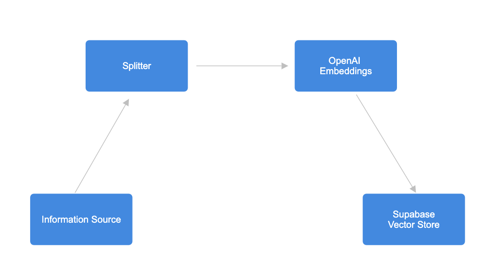
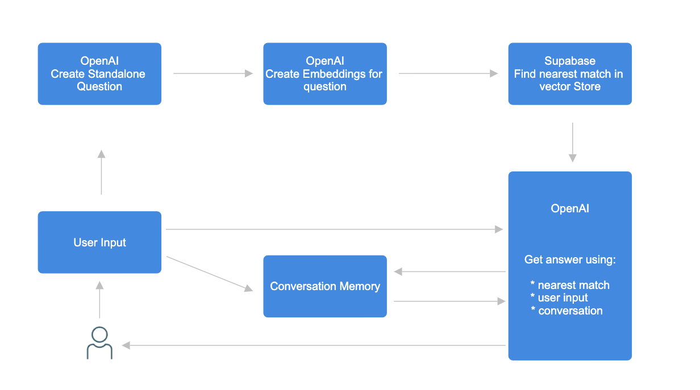

# OpenAI Personal ChatBot Interface

## Description
his project develops a web-based chatbot interface that leverages OpenAI's powerful language models. It is designed to process user queries, interact in a conversational manner, and provide informative and engaging responses. The backend is built on Node.js, using Express for server-side logic and handling HTTP requests. The frontend employs basic HTML, CSS, and JavaScript to capture user input and display chatbot responses dynamically.
## Features
- **OpenAI Language Model Integration:**: The chatbot uses OpenAI's advanced language models for natural language processing and generating responses. This allows it to understand and respond to a wide range of user queries effectively.
- **Web-Based Interface**: The chatbot is accessible through a web interface, making it easy for users to interact with it from any device with a web browser.
- **Real-Time Interaction:**: Users can engage in a real-time conversation with the chatbot. The chatbot processes user inputs and returns responses without significant delay.
- **Dynamic Content Handling**: The bot can handle dynamic content changes in the conversation, updating the chat in real-time as the conversation progresses.
- **Standalone Question Processing**: The chatbot can convert user questions into standalone questions, facilitating clearer and more focused responses.
- **Conversation History Management**: The chatbot can keep track of the conversation history, which might be used to provide context for subsequent responses.
- **Scalability and Extendibility**: Given its modular design and use of modern web technologies, the chatbot can be easily scaled and extended with additional features such as more advanced NLP capabilities, integration with databases, or additional APIs.

## Design:

  <h3 align="center">Data Embedding</h3>
  
  

<h3 align="center">Chatbot Design</h3>
  
  

### Information Source
- The chatbot begins with an *Information Source*, which contains the initial data to be processed. This data is likely a collection of documents or a knowledge base that the chatbot uses to find answers to user questions. Here i have use my resume as a data source.

### Splitter
- The *Splitter* is responsible for breaking down the information from the Information Source into manageable chunks. These chunks are then processed to create embeddings that can be used for matching queries with relevant information.

### OpenAI Embeddings
- The *OpenAI Embeddings* component uses OpenAI's language model to convert text data into vector embeddings. These embeddings represent the text in a way that captures semantic meaning and are suitable for comparison and retrieval tasks.

### Supabase Vector Store
- The *Supabase Vector Store* is used to store and index the embeddings generated by OpenAI. It allows for efficient retrieval of the most relevant chunks of information in response to a query.

### User Input
- This is the input provided by the end-user of the chatbot. It's the question or command that the user wants the chatbot to process.

### OpenAI Create Standalone Question
- This component takes the user's input and transforms it into a standalone question that is more understandable for the language model.

### OpenAI Create Embeddings for Question
- Similar to the OpenAI Embeddings process for the information source, this component creates embeddings for the standalone question.

### Supabase Find Nearest Match in Vector Store
- Using the embeddings for the question, this component queries the Supabase Vector Store to find the closest matching piece of information.

### Conversation Memory
- This represents the storage of the ongoing conversation's context, which can be used to provide continuity and context-aware responses.

### OpenAI Get Answer
- With the nearest match from the vector store, the user input, and the conversation memory, this component generates a response to the user's query.

## Workflow
1. The user submits a query via the web interface.
2. The query is converted into a standalone question and then into embeddings.
3. These embeddings are used to retrieve the closest matching information from the Supabase Vector Store.
4. Using the matched information, the user's query, and the stored conversation context, OpenAI's language model generates an appropriate response.
5. The response is then sent back to the user through the web interface.

## Technologies Used
- **OpenAI's Language Model**: For natural language understanding and response generation.
- **Supabase**: As a backend service to store and retrieve vector embeddings.
- **Node.js with Express**: For server-side logic and handling HTTP requests.
- **HTML/CSS/JavaScript**: For creating the user-facing chat interface.

## Conclusion
The chatbot application leverages cutting-edge NLP technology to provide users with accurate and context-aware responses, making it an effective tool for automating customer support, information retrieval, and more.

## Contact
- Your Name - [@SayedSohail10](https://twitter.com/SayedSohail10)
- Email - peerzadesayedsohail@gmail.com
- Project Link: [https://github.com/SaySohail/Chatbot](https://github.com/SaySohail/Chatbot)
